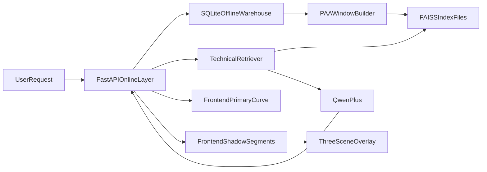

# FINANO STEP1-5 全量交付计划

## 目标与默认实施口径
- 以 `2核2G CVM` 为约束，在线链路只保留“查库 + 轻计算 + 展示”，所有重抓取/重计算迁移到离线任务。
- 按你原路线严格执行：默认采用“全市场镜像 + Three.js 影子线”口径推进。
- 对线上返回建立硬兜底：任何关键数据缺失统一返回 `data_not_ready`，不让 LLM 推测。

## 端到端架构

## Step1 后端：离线数据仓（全量镜像 + 增量刷新）
- 新增离线仓模块（独立于业务主库，避免锁竞争）：
  - `backend/app/modules/fund_offline/models.py`：`FundNavSnapshot(code, nav_date, nav, source, updated_at)`，唯一键 `(code, nav_date)`。
  - `backend/app/modules/fund_offline/session.py`：独立 SQLite engine（例如 `data/fund_offline.db`）。
  - `backend/app/modules/fund_offline/service.py`：全量/增量 `upsert`、批次提交、失败重试。
- 数据抓取策略：
  - 任务入口：`backend/scripts/sync_fund_nav_snapshot.py`（支持 `--full` 与 `--incremental`）。
  - 数据源优先复用现有 `fund_data` 通道：`backend/app/services/fund_data.py`。
  - 每日凌晨跑增量；每周一次低峰全量校准（修复漏点）。
- 调度接入：
  - 在 `backend/app/main.py` lifespan 内新增离线任务线程启动/停止。
  - 配置项扩展 `backend/app/core/config.py`（开关、并发、批次、重试、离线库路径、任务时窗）。

## Step2 核心：特征脱水与 FAISS 索引
- 新增索引构建管线：
  - `backend/app/agent/kline_feature_builder.py`：20日滑窗切片、PAA 压缩为 5 维、窗口元数据（code/start/end）。
  - `backend/app/agent/kline_faiss_store.py`：构建/保存/加载 FAISS 索引（`write_index/read_index`），元数据独立 JSONL/Parquet。
  - `backend/scripts/build_kline_faiss_index.py`：离线构建脚本，支持增量重建与全量重建。
- 索引产物与版本：
  - `data/index/kline_paa5.index`
  - `data/index/kline_paa5_meta.parquet`
  - `data/index/version.json`（构建时间、基金数、窗口数、校验和）。
- 运行策略：
  - 在线服务启动仅加载索引到内存，不做重构建。
  - 索引不可用时自动降级：返回 `data_not_ready` + 明确错误码。

## Step3 Agent：Technical 检索增强与硬兜底
- 改造 Technical 执行链：
  - `backend/app/agent/nodes.py`：`node_technical` 前置 FAISS 检索（TopK 相似片段）。
  - `backend/app/agent/state.py`：新增 `technical_retrieval` 字段（分数、历史日期、后续收益统计）。
  - `backend/app/agent/llm_client.py`：将检索 JSON（相似度、窗口日期、fwd_return_5d/10d/20d）注入 technical prompt。
- 新增检索服务层：
  - `backend/app/agent/kline_retriever.py`：输入基金代码 + 最近窗口，输出相似片段与统计。
- API 与 trace：
  - `backend/app/modules/agent/router.py`：在状态接口中输出 technical 检索摘要与 `data_version`。
  - 缺数据直接返回 `data_not_ready`，并在 trace 显示 `offline_data_missing`。

## Step4 前端：Vite + Three.js 异步联动
- 依赖与组件：
  - 前端新增 `three`（必要时加 `@react-three/fiber`，若采用原生 Three 则不加）。
  - 新增 `frontend/src/components/Chart/TechnicalShadowScene.tsx`（Three.js 影子线渲染容器）。
- 页面改造：
  - `frontend/src/pages/MAFB/index.tsx`：先渲染主净值/主K线；随后异步请求相似片段，拿到 `match_dates` 后加载影子线。
  - `frontend/src/components/FundNavCurvePanel.tsx`：保留主图首屏快显逻辑，增加与 Three 影子层的联动状态。
- 服务与类型：
  - `frontend/src/services/agent.ts`：新增“相似窗口详情”接口调用。
  - `frontend/src/types/*`：新增 technical retrieval 与 shadow segment 类型。
- 交互要求：
  - 首屏不等待 DTW/FAISS；影子线迟到可追加。
  - 切换基金/时间窗时中断旧请求，避免串线。

## Step5 稳定性、监控、验收与回滚
- 状态与可观测：
  - 新增 `backend/app/modules/fund_offline/router.py`：`/offline/status`（最近同步时间、成功率、索引版本、覆盖基金数）。
  - 新增任务指标：抓取耗时、失败率、索引构建时长、在线检索耗时 p50/p95。
- 可靠性策略：
  - 离线任务失败不影响在线进程；在线返回明确降级标识。
  - 索引版本化与原子切换（构建到临时文件，完成后 rename）。
- 验收标准：
  - 在线 Technical 首响应不被三方接口阻塞。
  - 相似检索毫秒级（索引命中路径）。
  - 前端首屏先出主图，影子线异步补齐。
  - 任意离线数据缺失时，返回 `data_not_ready` 且不触发 LLM 幻觉输出。

## 关键落点文件（优先改造）
- 后端入口与配置：[d:\FINANO\backend\app\main.py](d:/FINANO/backend/app/main.py), [d:\FINANO\backend\app\core\config.py](d:/FINANO/backend/app/core/config.py)
- 现有基金数据通道：[d:\FINANO\backend\app\services\fund_data.py](d:/FINANO/backend/app/services/fund_data.py)
- Agent 链路：[d:\FINANO\backend\app\agent\nodes.py](d:/FINANO/backend/app/agent/nodes.py), [d:\FINANO\backend\app\agent\state.py](d:/FINANO/backend/app/agent/state.py), [d:\FINANO\backend\app\agent\llm_client.py](d:/FINANO/backend/app/agent/llm_client.py), [d:\FINANO\backend\app\modules\agent\router.py](d:/FINANO/backend/app/modules/agent/router.py)
- 前端页面与图层：[d:\FINANO\frontend\src\pages\MAFB\index.tsx](d:/FINANO/frontend/src/pages/MAFB/index.tsx), [d:\FINANO\frontend\src\components\FundNavCurvePanel.tsx](d:/FINANO/frontend/src/components/FundNavCurvePanel.tsx), [d:\FINANO\frontend\src\services\agent.ts](d:/FINANO/frontend/src/services/agent.ts)
