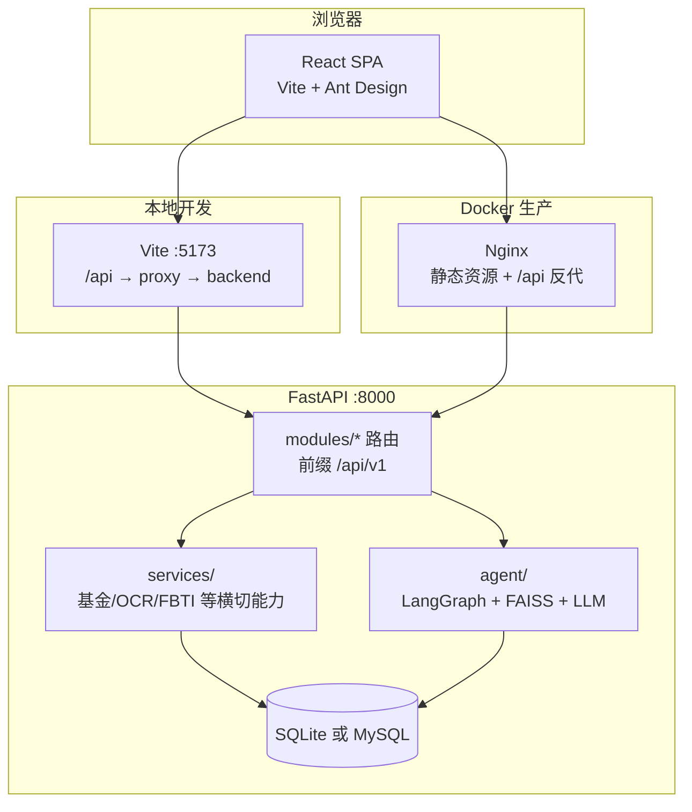
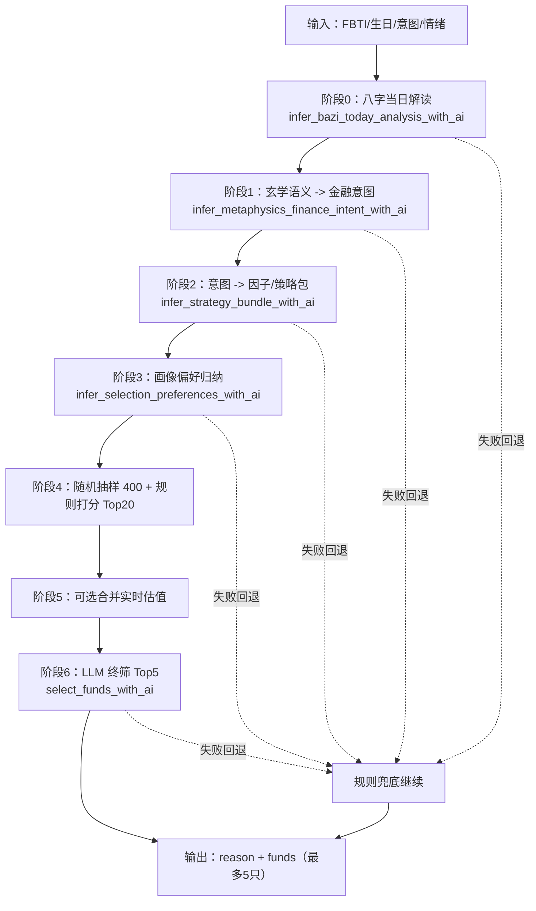

# Finano

## 版权与许可

- **Copyright © 2026 Tianyi Pu（浦天祎）。** All rights reserved.
- **开源许可：** 以仓库根目录 **`LICENSE`** 文件为准；若尚未添加该文件，请自行选用并上传许可证（如 MIT、Apache-2.0）。
- **第三方：** 本仓库依赖各开源库及其许可证（见 `package.json`、`requirements*.txt` 等）；**行情与模型 API** 受对应服务商条款约束，使用者须自行合规使用。
- **商标：** **「FINANO」** 及相关图形标识由 **Tianyi Pu（浦天祎）** 保留；未经许可，第三方不得以商业方式使用易造成混淆的近似标识。
- **免责声明：** 本项目（含 MAFB、FBTI、AI 选股等）仅供 **学习、演示与工程验证**，**不构成投资建议**；因使用本软件产生的任何直接或间接损失，**作者与贡献者不承担法律责任**。

**联系：** [tpuac@connect.ust.hk](mailto:tpuac@connect.ust.hk) · [3036238022@qq.com](mailto:3036238022@qq.com)

---

Finano 是企业轻量标准的全栈金融演示项目：`React 18 + TypeScript + Vite` 前端（Axios 统一拦截、全局 Loading、401 跳转登录、Zustand 用户态），`FastAPI + SQLAlchemy 2.0 + JWT` 后端；开发/演示默认 **SQLite**，生产可选 **MySQL**（Docker Compose），**不使用 Alembic**（小项目 `create_all` 即可）。

## 企业技术选型（刻意不用的组件）

| 不用 | 原因 | 本项目替代 |
|------|------|------------|
| Alembic | 单人/演示/内网工具改表不频繁 | `Base.metadata.create_all` |
| Celery + Redis | 小规模 OCR/抓取同步接口更稳 | 同步 FastAPI 路由 |
| Chroma | 依赖重、易踩坑 | **FAISS-CPU** 轻量向量检索 |
| TA-Lib | 跨平台编译问题多 | **Pandas** 指标与相似度计算 |

**基金代码识图**：安装 **EasyOCR** 后，`POST /api/v1/ocr/fund-code` 优先抽取 **6 位代码**；若无代码则从图中中文名称在全市场目录中 **反查 `primary_code`**，并返回 `matched_name`、`ocr_lines` 等；前端在 MAFB / 相似基金等输入框旁提供 **扫码图标** 触发。

**真实行情扩展**：设置环境变量 **`FUND_LIVE_QUOTE_ENABLED=true`** 后，`get_fund_by_code` 在静态演示池基础上合并 **东方财富/天天基金** 估值 JSONP（`app/services/fund_data.py`，失败自动忽略）。启动时自动 **`DROP TABLE IF EXISTS comments`**，清理旧版评论表，无需手删库（仍可与删库重建并用）。

## Finano AI：MAFB（多智能体金融决策大脑）— 报告可直接引用

- **定位**：LangGraph **0.2.18** 多智能体 + **DashScope Qwen-Finance / 通用**（云端优先）+ **Qwen-1.8B CPU**（本地兜底）+ **FAISS** RAG + 命理/画像结构化特征（MBTI、生日、风险偏好等），输出 **TOP5、推理链、仓位建议** 等强制 JSON。
- **智能体角色**：User Profiling → **Fundamental / Technical / Risk / K线相似**（四路并行）→ Allocation → Compliance → 投票决策。
- **核心接口**（均需登录）：
  - `POST /api/v1/agent/run` — MAFB 流水线（`use_saved_profile`）
  - `GET/POST /api/v1/agent/profile` — 用户档案画像
  - `GET /api/v1/agent/funds` — 基金目录分页（`items`、`total`、`catalog_mode`、`limit`、`offset`；可选 `q` 子串过滤）。默认 `FUND_CATALOG_MODE=static` 为内置演示池；设为 `eastmoney_full` 时从天天基金公开 JS 加载全市场索引（首次较慢）。`FUND_LIVE_QUOTE_ENABLED=true` 时仅在静态小池下为列表逐只合并 `live_quote`；全市场模式不对整表批量拉估值，避免上万次 HTTP。
  - `GET /api/v1/agent/funds/similar` — **Pandas 相似基金**（演示池静态特征）
  - `GET /api/v1/agent/funds/kline-similar` — **K 线/净值序列相似**（东方财富历史净值 `lsjz`，近 N 日对齐日收益率，余弦或 DTW）
  - `POST /api/v1/ocr/fund-code` — **EasyOCR 抽代码 / 按名称反查代码**
  - `GET/POST /api/v1/community/posts` — 社区 **发帖 + 点赞**（无评论接口）
- **数据库**：用户表含 `mbti、birth_date、layout_facing、risk_preference`；启动时删除遗留 **`comments`** 表（若存在）。若仍有其它历史表结构冲突，可删除 `finano.db` 后重启。

**简历表述示例**：基于通义千问金融 API 与 LangGraph 状态编排实现多智能体协同；FAISS RAG + 强制 JSON 投票；**云端与本地 Qwen-1.8B 双链路容灾**；前置合规拦截与可解释推理链输出。

## MAFB 总体实现（多 Agent / 数据源 / Prompt）

### 1) 流程总览（LangGraph）

MAFB 采用共享状态图，主链路为：

`profile -> preheat -> rag -> 并行五路(fundamental/technical/risk/attribution/profiling) -> allocation -> compliance -> voting|blocked`

- `profile`：构建用户画像（FBTI + 风险偏好）。
- `preheat`：一次性预热核心行情与结构化指标，尽量减少并行节点重复 I/O。
- `rag`：基金档案向量检索并注入事实片段。
- 五路并行：各 Agent 独立打分，回写 `agent_scores` / `agent_reasons`。
- `compliance`：禁宣词、错配和可选大模型审查。
- `voting`：权重汇总，生成 `final_report`。

### 2) 多 Agent 角色与数据源

| Agent | 角色 | 主要数据源 |
|------|------|------------|
| `fundamental` | 基本面（规模、经理、集中度、风格漂移、风险收益效率） | `fund_data` 预热结果（快照缓存 + 历史净值衍生 + 基本面抓取 + 新闻辅因子） |
| `technical` | 技术面（动量与趋势） | 预热统一读取的净值序列 `nav_rows_for_technical`、技术指标（EMA/Bias/RSI/MACD）、FAISS 技术检索结果 |
| `risk` | 风险与防御能力 | `risk_summary`（VaR95、Sortino、回撤、波动率、集中度、流动性、相关性）+ 新闻黑天鹅/政策扰动辅因子 |
| `attribution` | 业绩与风格归因 | `performance_style_attribution`（超额收益代理、收益来源拆解、风格相似度/偏离度） |
| `profiling` | 标的 × 用户画像适配 | `fund_data` + `user_profile` + `risk_level` |

补充说明：
- 并行五路使用共享状态，不是孤立内存。
- 关键缺失字段会触发 `data_not_ready`，并按节点降级到规则引擎或中性输出。
- 技术链路已优先复用预热内存数据，减少离线库重复读取冲突。

### 3) Prompt 设计（评分 Agent）

评分 Prompt 由统一模板生成，核心约束：

- 输出必须为 JSON：`agent_name`, `score`, `reason`。
- `score` 为整数 `-2 ~ +2`。
- `reason` 必须包含四段：`核心结论 / 硬事实数据 / 逻辑推演 / 评分标签`。
- 非 `profiling` Agent 禁止提“用户/画像/适配”字样，只谈标的。
- 数据缺失时需输出 `{"error":"数据源未就绪"}`（`fundamental` 已放宽为“核心特征全缺失才失败”）。

各 Agent 的 Prompt 侧重点：
- `fundamental`：持仓集中度、风格漂移、经理能力、规模、夏普与回撤（新闻仅辅助）。
- `technical`：EMA(5/20/60)、Bias20、RSI14、MACD、60 日动量与波动率，并结合 `technical_retrieval`。
- `risk`：回撤、波动、Sortino、VaR95、集中度、流动性、相关性（舆情不覆盖量化主结论）。
- `attribution`：超额收益来源拆解与风格偏离。
- `profiling`：用户画像与标的风格匹配度及错配风险。

### 4) 汇总与输出

`voting` 按固定权重汇总：

- fundamental: `0.24`
- technical: `0.24`
- risk: `0.22`
- attribution: `0.18`
- profiling: `0.12`

最终输出 `final_report` 关键字段包括：

- `weighted_total`, `scores`, `score_breakdown`
- `reasons`, `single_fund_analysis`
- `technical_summary`, `risk_summary`, `performance_style_attribution`
- `compliance`, `disclaimer`

整体目标：在可解释、可回溯、可降级的前提下，实现多智能体并行分析与结构化决策输出。

## FBTI（Finance MBTI）— 逻辑与产品设计

**FBTI**（**F**inance **MBTI**）是本项目内的**行为金融学演示画像**：8 道二选一问卷 → 生成 **四位类型码** → 映射到 **16 种金融人格归档**（R/S×L/T×D/F×C/A 全组合）；若用户档案中已有生日则仍参与五行融合规则。用于答辩与产品叙事，**不构成投资建议**（前后端文案均已声明）。

### 计分规则（与代码一致）

- **输入**：`answers` 长度 **8**，每项 **`A` 或 `B`**，顺序对应第 1–8 题（见 `frontend/src/pages/FbtiTest/index.tsx` 中 `QUESTIONS` 与 `backend/app/services/fbti_calculator.py` 中 `calculate_fbti` / `fbti_engine.score_fbti_code`）。
- **四维编码**（每维由 **两题** 计票，A/B 多者胜，平局规则见源码）：
  | 维度 | 字母 | 含义（题号在引擎内固定） |
  |------|------|--------------------------|
  | 1 | **R / S** | 偏稳健 vs 偏进取（风险风格） |
  | 2 | **L / T** | 偏长线 vs 偏短线（持仓周期） |
  | 3 | **D / F** | 偏数据 vs 偏直觉（决策方式） |
  | 4 | **C / A** | 偏集中 vs 偏分散（仓位习惯） |
- **输出**：四位字符串，例如 `RLDC`，与 MBTI 类似但语义为**金融行为**，非心理学 MBTI 官方量表。

### 人格归档（16 型）

- 定义在 `backend/app/services/fbti_calculator.py` 的 **`FBTI_PROFILES`**：每种含 **`name`、`risk_level`、`description`、`style_tags`、`fund_preference`**；引擎层注入演示用 **`wuxing`**（RL/RT/SL/ST 四象）供八字融合与 AI 提示。
- **`fbti_engine.match_archetype`**：四位码 **精确命中** 16 键之一则 `nearest_archetype: false`；非法或历史脏码则按 **汉明距离** 取最近型并 `nearest_archetype: true`。

### 生日与五行（工程化趣味规则）

- 用户可在 **个人画像** 填写生日并保存；FBTI 测试提交不再单独传生日。
- 若 **`user.birth_date`** 存在，会调用 `app/services/bazi_wuxing.py` 中 **`compute_today_wuxing_preference`**（公历生日 + 当前北京时间时辰的**规则表演示**，非专业命理）。
- **`fuse_wuxing`**：将归档上的 **人格五行** 与 **生日推演出的五行字** 合成展示串，写入 **`user.user_wuxing`**（≤32 字）；**前端 FBTI 结果页不再展示该字段**（避免无依据展示），后端仍可保留作接口兼容或后续扩展。

### 持久化字段（`User`）

- **`fbti_profile`**：四位类型码（及兼容近邻时的展示逻辑由 `match_archetype` 返回）。
- **`user_wuxing`**：五行合成串（可选，**结果页不展示**）。

### 后端接口

| 方法 | 路径 | 说明 |
|------|------|------|
| `POST` | `/api/v1/user/fbti/test` | 提交 8 题答案；可选 `birth_date`；计算码、归档、更新用户；见 `modules/user/router_fbti.py` |
| `GET` | `/api/v1/user/fbti/profile` | 读取当前用户的 FBTI、生日、归档信息（含可选 `user_wuxing` 字段） |
| `POST` | `/api/v1/agent/ai/fbti-select` | 基于已保存的 `fbti_profile` + 基金池快照，调用 **`ai_fund_selector`**（大模型 JSON 选股；**无 Key 时规则兜底**），见 `modules/agent/router.py` |

### 前端交互

- **`/fbti-result`**：侧栏「FBTI 画像」入口；从 **`GET /user/fbti/profile`** 读已存 **`fbti_profile`**（测完即写入 DB），有则展示结果。**「重新测试」** → **`/fbti-test?retake=1`**。无画像时「去测试」→ **`/fbti-test`**。
- **`/fbti-test`**：8 题测试；若已有画像且非 **`?retake=1`**，进入时 **`replace`** 至 **`/fbti-result`**（避免换页回来被迫重测）。提交后跳转 **`/fbti-result`**。
- **`/fbti`**：重定向至 **`/fbti-result`**（兼容旧书签）。
- **`/ai-fund-pick`**：**AI 选股** 独立页，调用 **`postFbtiAiSelect`**（`/agent/ai/fbti-select`）。
- **侧栏**：「FBTI 画像」→ **`/fbti-result`**；「AI 选股」等。
- **状态**：`store/fbtiStore.ts` 可缓存最近一次测试码等（便于跨页展示）。

### 测试与模块位置

- **单元测试**：`backend/tests/test_fbti_engine.py`（四位码与引擎一致性）。
- **核心文件**：`services/fbti_calculator.py`、`services/fbti_engine.py`、`services/bazi_wuxing.py`、`modules/user/router_fbti.py`、`services/ai_fund_selector.py`（与 `agent` 路由中的 FBTI 选股衔接）。

## 项目架构

### 总体视图



- **API 前缀**：`/api/v1`（`app/core/config.py` 中 `api_v1_prefix`）。
- **本地**：Axios 默认请求 `/api/v1`（`frontend/src/services/api.ts`）；Vite 将 **`/api` 代理到 `http://localhost:8000`**（`frontend/vite.config.ts`）。
- **Docker**：`frontend/nginx.conf` 将 **`/api` 转发到 `backend:8000`**，与静态页同源，减少生产环境 CORS 配置负担。

### 后端分层（`backend/app/`）

| 层级 | 路径 | 职责 |
|------|------|------|
| 入口 | `main.py` | `lifespan`：`create_all`、热点种子、`drop_legacy_comments_table`；**CORS**；**全局异常**；挂载各 `modules` 路由 |
| 核心 | `core/` | `config`（Pydantic Settings / `.env`）、`security`（JWT、密码哈希）、统一响应与异常 |
| 数据 | `db/` | SQLAlchemy **Engine / SessionLocal**、`Base`、启动时遗留表清理 |
| 业务模块 | `modules/*/` | 按领域：**router**（HTTP）、**schemas**（Pydantic）、**service**、**models**（SQLAlchemy，按需） |
| 横切服务 | `services/` | `fund_data`、`ocr`、`qwen_finance`、`similar_funds`、`fbti_engine`、`birth_ocr` 等，供路由与 agent 复用 |
| MAFB | `agent/` | **LangGraph**（`graph`、`nodes`、`state`）、**FAISS RAG**、`llm_client`、本地 Qwen 兜底、`profiling`、基金目录与相似度等 |

`main.py` 挂载顺序体现域划分：**auth + user**、**`router_fbti`（`/user/fbti/*`）**、`trade`、`note`、`ai`、**`agent`（MAFB，含 `/agent/ai/fbti-select`）**、`ocr`、`hot`、`community`。

### 前端分层（`frontend/src/`）

| 层级 | 路径 | 职责 |
|------|------|------|
| 入口 | `main.tsx` / `App.tsx` | **React Router**；`/login` 与受保护布局（JWT + `fetchMe` 恢复会话） |
| 页面 | `pages/*` | 仪表盘、交易、笔记、AI、MAFB、画像、相似基金、FBTI、社区等 |
| 布局与组件 | `components/` | `Layout/AppLayout`（侧栏与导航）、`Chart`、`UI/PageCard` |
| 请求 | `services/` | `api.ts` 统一 Axios（baseURL、拦截、Loading）；按域拆分 `user`、`trade`、`agent`、`fbti` 等 |
| 状态 | `store/` | **Zustand**：`userStore`、`appStore`（全局请求计数/Loading）、`fbtiStore` |

### 部署拓扑（Docker Compose）

- **`mysql`**：持久化卷；后端通过 **`DATABASE_URL`**（如 `mysql+pymysql://...@mysql:3306/...`）连接。
- **`backend`**：读根目录 **`.env`**（`env_file` + `environment` 注入）。
- **`frontend`**：Nginx 提供构建后的 SPA，并将 **`/api`** 转到后端服务名 **`backend:8000`**。

### 仓库目录（节选）

```text
finano/
├── frontend/
│   ├── src/
│   │   ├── pages/           # 路由页面
│   │   ├── components/      # 布局、图表、通用 UI
│   │   ├── services/        # Axios 与各域 API
│   │   ├── store/           # Zustand
│   │   └── App.tsx
│   ├── vite.config.ts       # 开发代理 /api
│   └── nginx.conf           # 生产镜像内 /api → backend
├── backend/
│   ├── app/
│   │   ├── main.py
│   │   ├── core/
│   │   ├── db/
│   │   ├── modules/         # user, trade, note, ai, agent, ocr, hot, community
│   │   ├── agent/           # MAFB（LangGraph 等）
│   │   └── services/        # 横切业务能力
│   ├── tests/
│   └── requirements.txt
├── docker-compose.yml
├── .env.example
└── README.md
```

## 已实现模块

- 用户注册、登录、JWT 鉴权
- 交易记录增查、统计汇总
- 交割单 OCR 导入
- AI 交易分析
- **MAFB 多智能体基金管线（LangGraph + FAISS RAG + 合规网关）**
- **FBTI 金融人格测评（四维编码、16 型归档；AI 选股独立入口）**
- 复盘笔记
- 热点新闻演示数据
- 社区发帖与点赞
- Docker Compose（MySQL + backend + frontend，无 Redis/Celery）

### MAFB（Multi-Agent Fund Brain）双轨说明

- **工程轨**：登录、交易、笔记、热点、社区、相似基金、**FBTI 测试/结果**、Docker。
- **智能体轨**：`backend/app/agent/` — 画像、基本面、技术面、风控、合规、配置与投票；**FAISS** RAG；**LangGraph** 状态共享。
- **前端路由**：`/mafb` 多智能体控制台、`/profile` 用户档案、**`/fbti-result`**（侧栏 FBTI 入口，读服务端已存画像）、**`/fbti-test`**（答题；已有画像时自动进结果，除非 **`?retake=1`**）、**`/fbti`** 重定向至 **`/fbti-result`**、**`/ai-fund-pick`**（独立「AI 选股」页）、`/similar-funds` 相似对比、`/community` 社区；基金识图为各页输入框旁 **扫码图标**。

### MAFB 与「AI 选股」：流程、输入输出、哪里用了 AI、为何偏慢

**MAFB（`/mafb` → `POST /api/v1/agent/run`）**

| 环节 | 说明 |
|------|------|
| **用户输入** | 主基金 **6 位代码**、可选 **MBTI / 生日 / 风险偏好 / 房屋朝向**，或勾选「使用档案已保存画像」。 |
| **针对性输出** | 结构化 **`final_report`**：加权总分、各智能体分数、**TOP5**（由 `top5.py` 对全目录 **确定性打分**，非 LLM 现写）、K 线相似列表、**推理链**（固定说明文案）、**仓位与流年上限**（规则）、**组合草案**（规则权重）、**合规**结论与备注、免责声明。 |
| **LangGraph 顺序** | `profile` → `rag` → **并行** `fundamental` / `technical` / `risk` / `kline_similar`（`Send`）→ `allocation` → `compliance` → `voting` 或 `blocked`。 |
| **大模型参与** | 仅 **基本面 / 技术面 / 风控** 三路尝试 `invoke_finance_agent_score`（要求 JSON）；**合规** 尝试 `invoke_compliance_llm`。失败则各节点有 **规则兜底**，流水线仍返回 200。 |
| **为何感觉慢** | ① 并行段里 **最多 3 次** 独立云端 LLM RTT；② **合规** 在并行之后又 **1 次** LLM；③ **多模态模型**（如 `qwen3.6-plus`）单次推理更重；④ 全市场模式下 **目录/K 线** 等 I/O；⑤ 网络到国际节点延迟。 |

**FBTI「AI 选股」（`/ai-fund-pick` → `POST /api/v1/agent/ai/fbti-select`）**

| 环节 | 说明 |
|------|------|
| **用户输入** | 登录用户已保存的 **FBTI 四位码**（及后端归档中的演示字段；选股页无需再填问卷）。 |
| **针对性输出** | 至多 **5 只** 基金 + **reason** 说明；管线为 **偏好 LLM → 随机 400 + 规则 Top20 → 终筛 LLM**，共 **2 次** 主要 LLM 调用。 |
| **为何慢** | 两次串行大模型 + 大目录抽样与打分；无 Key 时走规则会快很多。 |

### AI娱乐选基（FBTI）实现设计

#### 模块目标与定位

- **定位**：独立于 MAFB 的娱乐向选基链路，用于“自然语言策略灵感 + 结构化基金筛选”。
- **输入**：优先读取用户已保存画像（`fbti_profile`、生日/出生时段），可选叠加 `natural_intent` 与 `mood`。
- **输出**：结构化 `reason + funds[<=5]`，并在流式模式下返回 `bazi_analysis / intent / strategy_bundle` 作为可解释中间层。
- **合规边界**：不承诺收益，不输出确定性买卖建议。

#### 后端流程（多阶段编排）

入口函数：`run_fbti_ai_selection`（`backend/app/services/ai_fund_selector.py`）。



关键实现点：

- **阶段化 LLM**：每阶段只做单一任务（意图翻译、策略映射、终筛），降低提示词耦合与输出漂移。
- **候选池先收敛**：先规则筛到 Top20，再让模型终筛，避免“全库直接喂模型”导致 token 膨胀与不稳定。
- **结构化优先**：统一要求 JSON 输出，解析失败即回退规则，保证前端必有可展示结果。

#### 候选池与打分逻辑

- 随机池规模：`_FBTI_SAMPLE_POOL = 400`
- 规则保留：`_FBTI_RANK_TOP = 20`
- 终筛输入上限：`_FBTI_PROMPT_MAX_FUNDS = 20`

规则评分核心（`_score_fund_for_preferences`）融合：

- 偏好/回避赛道关键词匹配（`preferred_tracks` / `avoid_tracks`）
- 风险评级与用户风险偏好匹配
- ETF 偏好（`prefer_etf`）
- Sharpe、最大回撤、60 日动量等统计特征
- 五行标签与赛道语义的映射加分

终筛失败时采用 `_pick_diverse_fallback_funds`，保证结果具备基础分散度，不会被同一主题基金挤满。

#### API 与前端交互

后端接口（`backend/app/modules/agent/router.py`）：

- `POST /api/v1/agent/ai/fbti-select`：一键执行完整链路，返回最终结果。
- `POST /api/v1/agent/ai/fbti-select/intent`：仅返回“八字解读 + 意图翻译 + 策略包”预览。
- `POST /api/v1/agent/ai/fbti-select/stream`：SSE 流式推送阶段事件与最终结果。

前端页面（`frontend/src/pages/AiFundPick/index.tsx`）：

- 支持“预览意图与策略”与“流式执行”两种操作。
- 流式接收 `stage/bazi/intent/strategy/result`，实时显示阶段日志与中间结构化对象。
- 页面仅展示最终 Top5 结果，不再展示与主结果不一致的额外“趣味 TOP5”列表。

#### 模型与稳定性策略

- 该链路固定走 `agent_key="fbti"`，并支持 `force_model`。
- 配置项 `FBTI_LLM_MODEL` 默认 `qwen-plus`，用于避免跟随全局升级到 `qwen3.*` 带来的波动。
- 任一 LLM 阶段失败（超时、异常、非 JSON、缺字段）都不会中断主流程，统一降级到规则路径并返回可用结构化结果。

## 工程说明

- **注册 / 登录与 bcrypt**：若出现 `password cannot be longer than 72 bytes` 或日志里 **`bcrypt` has no attribute `__about__`**，多为 **`passlib` 1.7.4 与 `bcrypt` 4.1+/5.x** 不兼容；`requirements.txt` 已锁定 **`bcrypt==4.0.1`**。已有环境请执行：`pip install "bcrypt==4.0.1"` 后重启 uvicorn。
- 本地默认 **SQLite**；Docker 使用 **MySQL**。
- 指标与相似度：**Pandas / NumPy**，不用 TA-Lib。
- AI / OCR：无 Key 或缺依赖时有明确降级与提示，保证可演示。

## 本地启动

### Python 版本（必读）

| 版本 | 说明 |
|------|------|
| **3.10 / 3.11** | **推荐**，与本项目依赖（FastAPI、**SQLAlchemy 2.0**、LangChain 等）在 WSL / Linux 上最省心。仓库内 `backend/.python-version` 写为 `3.10`，供 **pyenv** 自动切换。 |
| **3.12** | 一般可用；需满足 `requirements.txt` 中 **pydantic>=2.7.4**（与 LangChain 解析一致）。 |
| **3.13** | **不推荐**。当前栈在 3.13 上易出现 **SQLAlchemy** 等库的兼容性错误（例如与 typing 相关的 `AssertionError: ... TypingOnly`）。若系统默认已是 3.13，请改用 **3.10/3.11** 单独建 venv（见下方 WSL）。 |

**用 Python 3.10 会不会和别的依赖冲突？** — **不会。** 说明如下：

- **`requirements.txt` 按包版本约束解析**，不绑定「必须用 3.12」；在 **3.10 / 3.11** 上 `pip` 会安装同一套约束下的兼容版本（如 **Pydantic 2.7+**、**SQLAlchemy 2.0.x**、**LangChain / LangGraph** 等均官方支持 3.10）。
- 注释里「3.12.4 要 pydantic≥2.7.4」是针对 **3.12 系** 的解析规则；在 **3.10** 上同样满足 `pydantic>=2.7.4`，无额外冲突。
- **Docker**（`backend/Dockerfile`）使用 **Python 3.11** 镜像，与本地 **3.10** 只差解释器小版本，**业务代码与依赖锁一致**，不属于冲突。
- **可选** `requirements-optional-local-llm.txt`（PyTorch 等）若安装，请选带 **cp310** 的轮子；与主 `requirements.txt` 无关。

**一键脚本（WSL）**：在 `backend` 下执行（首次需 `chmod +x scripts/dev-wsl.sh`）：

```bash
./scripts/dev-wsl.sh
```

脚本会：按顺序尝试 **`python3.10` → `python3.11` → `python3.12`** 创建 **`.venv`**，用 **`python -m pip`** 安装依赖，并以 `0.0.0.0:8000` 启动 **uvicorn**。

### 1. 后端（Windows）

```powershell
cd backend
python -m venv .venv
.\.venv\Scripts\Activate.ps1
pip install -r requirements.txt
# 国内网络若超时，可使用清华镜像：
# pip install -r requirements.txt -i https://pypi.tuna.tsinghua.edu.cn/simple
# 基金代码 EasyOCR（可选，体积较大）：
# pip install -r requirements-optional-easyocr.txt -i https://pypi.tuna.tsinghua.edu.cn/simple
uvicorn app.main:app --reload
```

### 1b. 后端（WSL / Linux）

虚拟环境目录名是 **`.venv`**（带点），激活路径为 **`.venv/bin/activate`**，**不要**写成 `venv`（无点会找不到）。

若曾用 **Python 3.13** 建过环境并出现 SQLAlchemy 等报错，按下面**重建**即可。

**解释器**：优先 **`python3.10`～`python3.12`**；若系统只有 **`python3`**，也可用（**须低于 3.13**）。  
缺少 `venv` 时，多数 Ubuntu 装 **`python3-venv`** 即可（不必纠结 `python3.11-venv` 这个包名是否存在）：

```bash
sudo apt update
sudo apt install -y python3 python3-venv python3-pip
```

```bash
conda deactivate    # 若在用 conda，先退出，避免与 venv 混用
deactivate          # 若已在某个 venv 里，先退出

cd /path/to/FINANO/backend
rm -rf .venv

# 任选其一：python3.10 / python3.11 / python3.12 / python3（不要 3.13）
python3 -m venv .venv
source .venv/bin/activate

# 务必用「虚拟环境里的 pip」，否则会触发 PEP 668（externally-managed-environment）
python3 -m pip install --upgrade pip
python3 -m pip install -r requirements.txt

python3 -m uvicorn app.main:app --reload --host 0.0.0.0 --port 8000 --app-dir "$(pwd)"
```

成功时终端会出现 `Uvicorn running on http://0.0.0.0:8000`，浏览器打开 **`http://localhost:8000/docs`**。

**若浏览器访问 `/docs` 返回 `{"detail":"Not Found"}`**：先在同一 WSL 里执行 `curl -s http://127.0.0.1:8000/` 与 `curl -sI http://127.0.0.1:8000/docs`。若 `curl` 正常而 Windows 浏览器异常，多为本机 **8000 端口被其它程序占用**（浏览器打到了别的进程）；在 Windows 上 `netstat -ano | findstr :8000` 排查。启动时加上 **`--app-dir "$(pwd)"`**（上例已含）可减轻 **`/mnt/d/`** 下模块解析异常的情况。

### MAFB 金融大模型（云端主力 + 本地容灾）

- **主力（有网）**：`DASHSCOPE_API_KEY` + **`FINANCE_MODEL_NAME`（优先）** 或 `QWEN_FINANCE_MODEL`；代码内已注入**金融专家系统提示词**（通用强模型 + 专业 Prompt）。**DashScope 原生 SDK 优先**；失败时依次尝试 **DeepSeek / Ollama**（与 DashScope 不同密钥），再本地 Qwen。
- **国际/新加坡控制台**：Key 与大陆节点不互通时，在 **`backend/.env`** 设 **`DASHSCOPE_USE_INTL=true`**（自动使用 `https://dashscope-intl.aliyuncs.com/api/v1`），或 **`DASHSCOPE_BASE_URL=https://dashscope-intl.aliyuncs.com`**（程序会补全 `/api/v1`）。自测脚本会自动 `chdir` 到 `backend` 并读 **`backend/.env`**，可从任意目录用绝对路径运行，例如 WSL：`python /mnt/d/FINANO/backend/scripts/test_dashscope_ping.py`（勿在 `~` 下执行 `cd backend`，除非你的家目录里真有该文件夹）。若需与 curl 完全一致的对照，可用 **`scripts/test_dashscope_raw_http.py`**（`httpx` + `Bearer`；**多模态模型**如 `qwen3.6-plus` 走 `.../multimodal-generation/generation`，纯文本模型可走 `.../text-generation/generation`）。
- **离线降级（无 API、演示不翻车）**：`MAFB_LLM_MODE=auto` 时，云端全失败后自动切换 **`LOCAL_FINANCE_MODEL_ID` 本地 Qwen-1.8B 系权重（CPU）**，见 `backend/app/agent/local_qwen.py`。安装额外依赖：
  ```bash
  pip install -r requirements-optional-local-llm.txt -i https://pypi.tuna.tsinghua.edu.cn/simple
  ```
  默认权重 ID 为 `Qwen/Qwen1.8B-Chat`；若你有社区 **Qwen-1.8B-Finance** 微调仓库，直接改 `LOCAL_FINANCE_MODEL_ID` 即可。
- **纯本地演示**：`MAFB_LLM_MODE=local_only`（不请求任何云 API）。
- **规则兜底**：未装 torch 或模型加载失败时，分析师与合规仍走 **确定性规则引擎**。
- **简历表述建议**：基于通义千问金融 API 构建多智能体推理核心，并实现 **云端 API 与本地开源 Qwen-1.8B 系权重双链路容灾**，低温结构化 JSON 输出支撑 Agent 投票与合规审查。

后端文档地址：`http://localhost:8000/docs`

### 2. 前端

```bash
cd frontend
npm install
npm run dev
```

前端地址：`http://localhost:5173`

## Docker 启动

```bash
copy .env.example .env
docker-compose up --build
```

## 演示建议流程

1. 注册并登录系统
2. 在交易记录页新增一笔交易或上传交割单图片
3. 在仪表盘查看收益曲线与核心指标
4. 在 **个人画像** 保存 MBTI / 生日 / 风险偏好，再在 **MAFB** 勾选「使用已保存画像」运行流水线，查看 **TOP5 + 推理链 + 仓位建议**
5. 在 AI 页面选择交易生成复盘分析
6. 在复盘笔记页补充总结
7. 在 **MAFB / 相似基金** 等页用输入框旁 **扫码** 上传截图识别代码，或在 **相似基金** 页手动输入代码对比；在社区页发帖、点赞
8. 侧栏 **「FBTI 画像」**：完成测试后切到 **「结果」** Tab 查看人格；需要时在 **「AI 选股」** 页单独跑一键选股（与 MAFB 解耦）

## 测试

```bash
cd backend
pip install -r requirements.txt
pytest tests/test_mafb_graph.py -v   # LangGraph 全链路 + 并行 fan-out + 合规/投票字段断言
pytest tests/test_fund_data.py -v   # 天天基金 JSONP 解析（无网也可跑）
pytest
```
