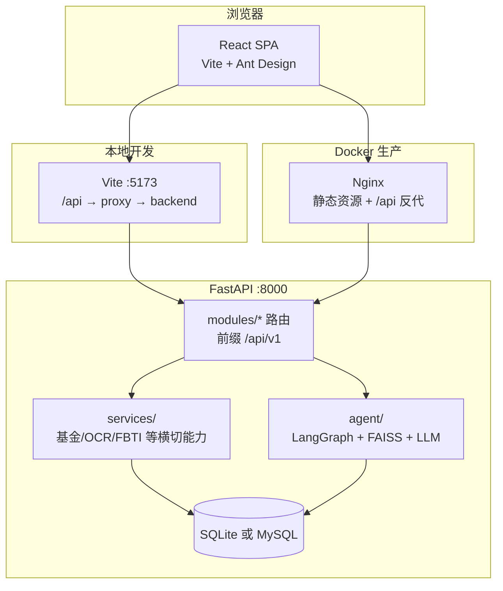

# Finano

Finano 是企业轻量标准的全栈金融演示项目：`React 18 + TypeScript + Vite` 前端（Axios 统一拦截、全局 Loading、401 跳转登录、Zustand 用户态），`FastAPI + SQLAlchemy 2.0 + JWT` 后端；开发/演示默认 **SQLite**，生产可选 **MySQL**（Docker Compose），**不使用 Alembic**（小项目 `create_all` 即可）。

## 企业技术选型（刻意不用的组件）

| 不用 | 原因 | 本项目替代 |
|------|------|------------|
| Alembic | 单人/演示/内网工具改表不频繁 | `Base.metadata.create_all` |
| Celery + Redis | 小规模 OCR/抓取同步接口更稳 | 同步 FastAPI 路由 |
| Chroma | 依赖重、易踩坑 | **FAISS-CPU** 轻量向量检索 |
| TA-Lib | 跨平台编译问题多 | **Pandas** 指标与相似度计算 |

**基金代码识图**：安装 **EasyOCR**（`pip install -r requirements-optional-easyocr.txt`）后，`POST /api/v1/ocr/fund-code` 使用 `readtext(..., detail=0)` 抽取 **6 位代码**（如 `005827`），返回 `codes` 与 **`primary_code`（首个候选）**；未安装时返回明确安装提示。

**真实行情扩展**：设置环境变量 **`FUND_LIVE_QUOTE_ENABLED=true`** 后，`get_fund_by_code` 在静态演示池基础上合并 **东方财富/天天基金** 估值 JSONP（`app/services/fund_data.py`，失败自动忽略）。启动时自动 **`DROP TABLE IF EXISTS comments`**，清理旧版评论表，无需手删库（仍可与删库重建并用）。

## Finano AI：MAFB（多智能体金融决策大脑）— 报告可直接引用

- **定位**：LangGraph **0.2.18** 多智能体 + **DashScope Qwen-Finance / 通用**（云端优先）+ **Qwen-1.8B CPU**（本地兜底）+ **FAISS** RAG + 命理/画像结构化特征（MBTI、生日、环境偏好、风险偏好等），输出 **TOP5、推理链、仓位建议** 等强制 JSON。
- **智能体角色**：User Profiling → **Fundamental / Technical / Risk / K线相似**（四路并行）→ Allocation → Compliance → 投票决策。
- **核心接口**（均需登录）：
  - `POST /api/v1/agent/run` — MAFB 流水线（`use_saved_profile`）
  - `GET/POST /api/v1/agent/profile` — 用户档案画像
  - `GET /api/v1/agent/funds` — 演示基金池（`FUND_LIVE_QUOTE_ENABLED=true` 时每只基金可带 `live_quote`，含 `gzjs`/`gszzl`/`gssj` 等；首次请求会因限流略慢）
  - `GET /api/v1/agent/funds/similar` — **Pandas 相似基金**（演示池静态特征）
  - `GET /api/v1/agent/funds/kline-similar` — **K 线/净值序列相似**（东方财富历史净值 `lsjz`，近 N 日对齐日收益率，余弦或 DTW）
  - `POST /api/v1/agent/ocr-birth` — 生日 OCR（百度等，见原有逻辑）
  - `POST /api/v1/ocr/fund-code` — **EasyOCR 仅抽 6 位基金代码**
  - `GET/POST /api/v1/community/posts` — 社区 **发帖 + 点赞**（无评论接口）
- **数据库**：用户表含 `mbti、birth_date、layout_facing、risk_preference`；启动时删除遗留 **`comments`** 表（若存在）。若仍有其它历史表结构冲突，可删除 `finano.db` 后重启。

**简历表述示例**：基于通义千问金融 API 与 LangGraph 状态编排实现多智能体协同；FAISS RAG + 强制 JSON 投票；**云端与本地 Qwen-1.8B 双链路容灾**；前置合规拦截与可解释推理链输出。

## FBTI（Finance MBTI）— 逻辑与产品设计

**FBTI**（**F**inance **MBTI**）是本项目内的**行为金融学演示画像**：8 道二选一问卷 → 生成 **四位类型码** → 映射到 **8 种高频投资人格归档**，可选填 **生日** 与 **五行趣味合成**。用于答辩与产品叙事，**不构成投资建议**（前后端文案均已声明）。

### 计分规则（与代码一致）

- **输入**：`answers` 长度 **8**，每项 **`A` 或 `B`**，顺序对应第 1–8 题（见 `frontend/src/pages/FbtiTest/index.tsx` 中 `QUESTIONS` 与 `backend/app/services/fbti_engine.py` 中 `score_fbti_code`）。
- **四维编码**（每维由 **两题** 计票，A/B 多者胜，平局规则见源码）：
  | 维度 | 字母 | 含义（题号在引擎内固定） |
  |------|------|--------------------------|
  | 1 | **R / S** | 偏稳健 vs 偏进取（风险风格） |
  | 2 | **L / T** | 偏长线 vs 偏短线（持仓周期） |
  | 3 | **D / F** | 偏数据 vs 偏直觉（决策方式） |
  | 4 | **C / A** | 偏集中 vs 偏分散（仓位习惯） |
- **输出**：四位字符串，例如 `RLDC`，与 MBTI 类似但语义为**金融行为**，非心理学 MBTI 官方量表。

### 人格归档（8 种原型）

- 定义在 `backend/app/services/fbti_engine.py` 的 `_ARCHETYPES`：每种含 **`code`、`name`、`wuxing`（五行标签）、`tags`、`blurb`**（如「守财金牛」「赛道猎手」等）。
- **匹配**：若四位码与某一归档 **完全一致**，直接命中；否则按 **汉明距离** 取最近归档，并标记 **`nearest_archetype: true`**（`match_archetype`）。

### 生日与五行（工程化趣味规则）

- 提交测试时可带 **`birth_date`**：会写入用户 **`birth_date`**，并调用 `app/services/bazi_wuxing.py` 中 **`compute_today_wuxing_preference`**（公历生日 + 当前北京时间时辰的**规则表演示**，非专业命理）。
- **`fuse_wuxing`**：将归档上的 **人格五行** 与 **生日推演出的五行字** 合成展示串，写入 **`user.user_wuxing`**（≤32 字），用于结果页 Tag 与后续 AI 选股提示。

### 持久化字段（`User`）

- **`fbti_profile`**：四位类型码（及兼容近邻时的展示逻辑由 `match_archetype` 返回）。
- **`user_wuxing`**：五行展示串（人格五行 ± 生日融合）。

### 后端接口

| 方法 | 路径 | 说明 |
|------|------|------|
| `POST` | `/api/v1/user/fbti/test` | 提交 8 题答案；可选 `birth_date`；计算码、归档、更新用户；见 `modules/user/router_fbti.py` |
| `GET` | `/api/v1/user/fbti/profile` | 读取当前用户的 FBTI 与五行、生日、归档信息 |
| `POST` | `/api/v1/agent/ai/fbti-select` | 基于已保存的 `fbti_profile` + 基金池快照，调用 **`ai_fund_selector`**（大模型 JSON 选股；**无 Key 时规则兜底**），见 `modules/agent/router.py` |

### 前端交互

- **`/fbti-test`**：分步一题一屏，**进度条** + **Radio**；可选 **DatePicker** 生日；提交后 **`postFbtiTest`**，成功则 **`navigate('/fbti-result')`**，并刷新 `userStore`。
- **`/fbti-result`**：拉取 **`getFbtiProfile`**，展示人格名、五行 **Tag**（按首字着色）、生日；可点击 **「AI 组合建议」** 调用 **`postFbtiAiSelect`**（`/agent/ai/fbti-select`）。
- **侧栏**：`AppLayout` 中提供「FBTI 测试」「FBTI 结果」入口。
- **状态**：`store/fbtiStore.ts` 可缓存最近一次测试码与五行（便于跨页展示）。

### 测试与模块位置

- **单元测试**：`backend/tests/test_fbti_engine.py`（四位码与引擎一致性）。
- **核心文件**：`services/fbti_engine.py`、`services/bazi_wuxing.py`、`modules/user/router_fbti.py`、`services/ai_fund_selector.py`（与 `agent` 路由中的 FBTI 选股衔接）。

## 项目架构

### 总体视图



- **API 前缀**：`/api/v1`（`app/core/config.py` 中 `api_v1_prefix`）。
- **本地**：Axios 默认请求 `/api/v1`（`frontend/src/services/api.ts`）；Vite 将 **`/api` 代理到 `http://localhost:8000`**（`frontend/vite.config.ts`）。
- **Docker**：`frontend/nginx.conf` 将 **`/api` 转发到 `backend:8000`**，与静态页同源，减少生产环境 CORS 配置负担。

### 后端分层（`backend/app/`）

| 层级 | 路径 | 职责 |
|------|------|------|
| 入口 | `main.py` | `lifespan`：`create_all`、热点种子、`drop_legacy_comments_table`；**CORS**；**全局异常**；挂载各 `modules` 路由 |
| 核心 | `core/` | `config`（Pydantic Settings / `.env`）、`security`（JWT、密码哈希）、统一响应与异常 |
| 数据 | `db/` | SQLAlchemy **Engine / SessionLocal**、`Base`、启动时遗留表清理 |
| 业务模块 | `modules/*/` | 按领域：**router**（HTTP）、**schemas**（Pydantic）、**service**、**models**（SQLAlchemy，按需） |
| 横切服务 | `services/` | `fund_data`、`ocr`、`qwen_finance`、`similar_funds`、`fbti_engine`、`birth_ocr` 等，供路由与 agent 复用 |
| MAFB | `agent/` | **LangGraph**（`graph`、`nodes`、`state`）、**FAISS RAG**、`llm_client`、本地 Qwen 兜底、`profiling`、基金目录与相似度等 |

`main.py` 挂载顺序体现域划分：**auth + user**、**`router_fbti`（`/user/fbti/*`）**、`trade`、`note`、`ai`、**`agent`（MAFB，含 `/agent/ai/fbti-select`）**、`ocr`、`hot`、`community`。

### 前端分层（`frontend/src/`）

| 层级 | 路径 | 职责 |
|------|------|------|
| 入口 | `main.tsx` / `App.tsx` | **React Router**；`/login` 与受保护布局（JWT + `fetchMe` 恢复会话） |
| 页面 | `pages/*` | 仪表盘、交易、笔记、AI、MAFB、画像、OCR 识码、相似基金、FBTI、社区等 |
| 布局与组件 | `components/` | `Layout/AppLayout`（侧栏与导航）、`Chart`、`UI/PageCard` |
| 请求 | `services/` | `api.ts` 统一 Axios（baseURL、拦截、Loading）；按域拆分 `user`、`trade`、`agent`、`fbti` 等 |
| 状态 | `store/` | **Zustand**：`userStore`、`appStore`（全局请求计数/Loading）、`fbtiStore` |

### 部署拓扑（Docker Compose）

- **`mysql`**：持久化卷；后端通过 **`DATABASE_URL`**（如 `mysql+pymysql://...@mysql:3306/...`）连接。
- **`backend`**：读根目录 **`.env`**（`env_file` + `environment` 注入）。
- **`frontend`**：Nginx 提供构建后的 SPA，并将 **`/api`** 转到后端服务名 **`backend:8000`**。

### 仓库目录（节选）

```text
finano/
├── frontend/
│   ├── src/
│   │   ├── pages/           # 路由页面
│   │   ├── components/      # 布局、图表、通用 UI
│   │   ├── services/        # Axios 与各域 API
│   │   ├── store/           # Zustand
│   │   └── App.tsx
│   ├── vite.config.ts       # 开发代理 /api
│   └── nginx.conf           # 生产镜像内 /api → backend
├── backend/
│   ├── app/
│   │   ├── main.py
│   │   ├── core/
│   │   ├── db/
│   │   ├── modules/         # user, trade, note, ai, agent, ocr, hot, community
│   │   ├── agent/           # MAFB（LangGraph 等）
│   │   └── services/        # 横切业务能力
│   ├── tests/
│   └── requirements.txt
├── docker-compose.yml
├── .env.example
└── README.md
```

## 已实现模块

- 用户注册、登录、JWT 鉴权
- 交易记录增查、统计汇总
- 交割单 OCR 导入
- AI 交易分析
- **MAFB 多智能体基金管线（LangGraph + FAISS RAG + 合规网关）**
- **FBTI 金融人格测评（四维编码、8 原型归档、五行融合、AI 选股兜底）**
- 复盘笔记
- 热点新闻演示数据
- 社区发帖与点赞
- Docker Compose（MySQL + backend + frontend，无 Redis/Celery）

### MAFB（Multi-Agent Fund Brain）双轨说明

- **工程轨**：登录、交易、笔记、热点、社区、OCR 识码、相似基金、**FBTI 测试/结果**、Docker。
- **智能体轨**：`backend/app/agent/` — 画像、基本面、技术面、风控、合规、配置与投票；**FAISS** RAG；**LangGraph** 状态共享。
- **前端路由**：`/mafb` 多智能体控制台、`/profile` 用户档案、`/fbti-test` 与 **`/fbti-result`**（FBTI）、`/ocr-fund` 基金代码识图、`/similar-funds` 相似对比、`/community` 社区。

## 工程说明

- 本地默认 **SQLite**；Docker 使用 **MySQL**。
- 指标与相似度：**Pandas / NumPy**，不用 TA-Lib。
- AI / OCR：无 Key 或缺依赖时有明确降级与提示，保证可演示。

## 本地启动

### Python 版本（必读）

| 版本 | 说明 |
|------|------|
| **3.10 / 3.11** | **推荐**，与本项目依赖（FastAPI、**SQLAlchemy 2.0**、LangChain 等）在 WSL / Linux 上最省心。仓库内 `backend/.python-version` 写为 `3.10`，供 **pyenv** 自动切换。 |
| **3.12** | 一般可用；需满足 `requirements.txt` 中 **pydantic>=2.7.4**（与 LangChain 解析一致）。 |
| **3.13** | **不推荐**。当前栈在 3.13 上易出现 **SQLAlchemy** 等库的兼容性错误（例如与 typing 相关的 `AssertionError: ... TypingOnly`）。若系统默认已是 3.13，请改用 **3.10/3.11** 单独建 venv（见下方 WSL）。 |

### 1. 后端（Windows）

```powershell
cd backend
python -m venv .venv
.\.venv\Scripts\Activate.ps1
pip install -r requirements.txt
# 国内网络若超时，可使用清华镜像：
# pip install -r requirements.txt -i https://pypi.tuna.tsinghua.edu.cn/simple
# 基金代码 EasyOCR（可选，体积较大）：
# pip install -r requirements-optional-easyocr.txt -i https://pypi.tuna.tsinghua.edu.cn/simple
uvicorn app.main:app --reload
```

### 1b. 后端（WSL / Linux）

虚拟环境目录名是 **`.venv`**（带点），激活路径为 **`.venv/bin/activate`**，**不要**写成 `venv`（无点会找不到）。

若曾用 **Python 3.13** 建过环境并出现 SQLAlchemy 等报错，按下面**重建**即可（需已安装 `python3.10`，Ubuntu 可用 [deadsnakes](https://launchpad.net/~deadsnakes/+archive/ubuntu/ppa) 或 `sudo apt install python3.10-venv`）：

```bash
conda deactivate    # 若在用 conda，先退出，避免与 venv 混用
deactivate          # 若已在某个 venv 里，先退出

cd /path/to/FINANO/backend
rm -rf .venv

python3.10 -m venv .venv
source .venv/bin/activate

pip install --upgrade pip
pip install -r requirements.txt

uvicorn app.main:app --reload --host 0.0.0.0 --port 8000
```

成功时终端会出现 `Uvicorn running on http://0.0.0.0:8000`，浏览器打开 **`http://localhost:8000/docs`**。

### MAFB 金融大模型（云端主力 + 本地容灾）

- **主力（有网）**：`DASHSCOPE_API_KEY` + **`FINANCE_MODEL_NAME`（优先）** 或 `QWEN_FINANCE_MODEL`；代码内已注入**金融专家系统提示词**（通用强模型 + 专业 Prompt）。**DashScope 优先**；失败时可经 **Tongyi / DeepSeek / Ollama**。
- **离线降级（无 API、演示不翻车）**：`MAFB_LLM_MODE=auto` 时，云端全失败后自动切换 **`LOCAL_FINANCE_MODEL_ID` 本地 Qwen-1.8B 系权重（CPU）**，见 `backend/app/agent/local_qwen.py`。安装额外依赖：
  ```bash
  pip install -r requirements-optional-local-llm.txt -i https://pypi.tuna.tsinghua.edu.cn/simple
  ```
  默认权重 ID 为 `Qwen/Qwen1.8B-Chat`；若你有社区 **Qwen-1.8B-Finance** 微调仓库，直接改 `LOCAL_FINANCE_MODEL_ID` 即可。
- **纯本地演示**：`MAFB_LLM_MODE=local_only`（不请求任何云 API）。
- **规则兜底**：未装 torch 或模型加载失败时，分析师与合规仍走 **确定性规则引擎**。
- **简历表述建议**：基于通义千问金融 API 构建多智能体推理核心，并实现 **云端 API 与本地开源 Qwen-1.8B 系权重双链路容灾**，低温结构化 JSON 输出支撑 Agent 投票与合规审查。

后端文档地址：`http://localhost:8000/docs`

### 2. 前端

```bash
cd frontend
npm install
npm run dev
```

前端地址：`http://localhost:5173`

## Docker 启动

```bash
copy .env.example .env
docker-compose up --build
```

## 演示建议流程

1. 注册并登录系统
2. 在交易记录页新增一笔交易或上传交割单图片
3. 在仪表盘查看收益曲线与核心指标
4. 在 **个人画像** 保存 MBTI / 生日 / 风险偏好，再在 **MAFB** 勾选「使用已保存画像」运行流水线，查看 **TOP5 + 推理链 + 仓位建议**
5. 在 AI 页面选择交易生成复盘分析
6. 在复盘笔记页补充总结
7. 在 **OCR 识图** 页上传含代码的截图，或 **相似基金** 页输入代码对比；在社区页发帖、点赞

## 测试

```bash
cd backend
pip install -r requirements.txt
pytest tests/test_mafb_graph.py -v   # LangGraph 全链路 + 并行 fan-out + 合规/投票字段断言
pytest tests/test_fund_data.py -v   # 天天基金 JSONP 解析（无网也可跑）
pytest
```
