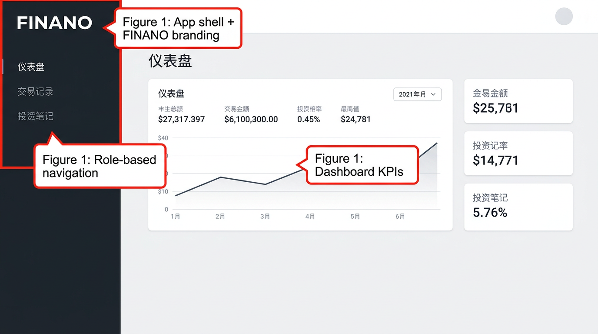
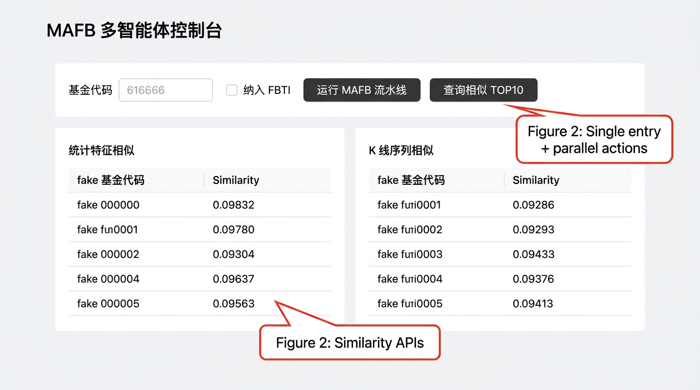
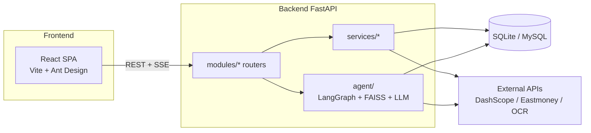

# FINANO — Milestone Progress Report

**Document:** mid-term / milestone summary  
**Audience:** course staff, technical reviewers, sponsors  
**Length:** ~2–3 pages when printed or exported to PDF  

---

## 1. Executive summary

**FINANO** is a full-stack fintech-style web application: a **React + TypeScript + Vite** SPA with **Ant Design**, backed by **FastAPI**, **SQLAlchemy 2.0**, and **JWT** auth. The product emphasizes **portfolio tracking**, **notes**, **community**, **FBTI (Finance MBTI) profiling**, **AI-assisted fund selection**, and a **MAFB (multi-agent)** LangGraph pipeline with RAG, compliance checks, and similarity analytics.

**Status:** Core user flows, MAFB console, FBTI questionnaire/results, fund catalog/pool, OCR-assisted fund-code entry, and Docker-oriented deployment paths are **implemented and demo-ready**. Remaining work focuses on **performance hardening**, **broader automated tests**, **documentation sync with latest APIs**, and optional **public hosting**. **§3** documents **MAFB** and **FBTI AI 选股** end-to-end **LLM integration** (shared adapter, JSON contracts, fallbacks).

---

## 2. Completed work (high level)

- **Authentication & profile:** Register/login, JWT storage (Zustand), protected routes, user profile fields (e.g. MBTI, birth date, risk preference) for MAFB/FBTI integration.
- **Core product pages:** Dashboard, trades, notes, AI page, community (posts/likes).
- **FBTI:** 8-question flow, four-letter code, 16 archetypes, persistence via user APIs; dedicated result and AI fund-pick pages.
- **MAFB:** LangGraph **0.2.x** graph with profiling → parallel analysts (fundamental / technical / risk / k-line similarity) → allocation → compliance → final report; **SSE** streaming for stage labels on the MAFB UI.
- **Fund data:** Catalog modes (`static` vs `eastmoney_full`), optional live quote merge, **EasyOCR** fund-code endpoint with name→code fallback.
- **Similarity:** Pandas feature cosine (`/agent/funds/similar`) and **K-line / NAV** similarity (`/agent/funds/kline-similar`) with throttling, caching, and candidate pre-filtering to keep latency practical.
- **UX / branding:** FINANO logos in shell and login; dark gray shell aligned with brand; MAFB form simplified to **fund code + optional FBTI inclusion**, dual actions (run pipeline vs. similarity query) with **mutual exclusion** while a job runs.
- **Resilience / performance (recent):** LLM **deadlines** for scoring agents, shorter HTTP timeouts on fallback channels, and **feature-first** narrowing before batched NAV fetches for K-line similarity.
- **Infrastructure:** `docker-compose` for MySQL + app patterns documented in README; local Vite proxy to FastAPI.

---

## 3. MAFB 与 AI 选股：大模型调用技术实现（重点）

本节说明两条产品链路如何**复用同一套金融 LLM 适配层**、如何约束**结构化输出**、以及失败时如何**降级**，便于答辩与代码审阅对照实现。

### 3.1 统一金融 LLM 适配层（`backend/app/agent/llm_client.py`）

所有 MAFB 打分、合规辅助、以及 AI 选股中的 JSON 阶段，最终都落到 **`_invoke_finance_llm`**（AI 选股通过 `ai_fund_selector` 直接调用该函数）。

| 机制 | 说明 |
|------|------|
| **人设注入** | `_augment_messages_with_finance_persona` 在首条 `system` 前叠加「持牌、合规、不预测短期涨跌」等 **FINANCE_EXPERT_SYSTEM_PROMPT**，把通用聊天模型约束成金融分析口吻。 |
| **路由与降级链** | `MAFB_LLM_MODE`：`auto`（默认）先 **DashScope**（`FINANCE_MODEL_NAME` / `QWEN_FINANCE_MODEL`）→ **DeepSeek**（OpenAI 兼容 `httpx`）→ **Ollama** →（`auto` 且允许时）**本地 Qwen-1.8B**；`cloud_only` 不走本地；`local_only` 仅用本地 + Ollama 兜底。 |
| **DashScope 双 API** | 按模型名分支：含 **qwen3** / **-vl** / **qvq** 等走 **`MultiModalConversation`**（多模态接口），其余走 **`Generation.call`**，避免「模型已升级但 SDK 路径不匹配」导致的空响应。 |
| **解析与契约** | MAFB 单智能体打分走 **`invoke_finance_agent_score`**：要求模型只输出 JSON，用 **`AgentScore`（Pydantic）** 校验 `agent_name` / `score(-2~2)` / `reason`；合规走 **`ComplianceLLMResult`**。解析失败返回 `None`，由业务层走规则。 |
| **打分超时** | `invoke_finance_agent_score` 在独立线程中执行 `_invoke_finance_llm`，用 **`MAFB_AGENT_LLM_TIMEOUT_SEC`**（默认约 16s）`future.result(timeout=…)`；超时则放弃 LLM，**并行分析师节点**回退到夏普/动量/风险差等 **确定性规则分**（`nodes.py` 中 `_fundamental_rule`、`_technical_rule`、`_risk_rule`）。 |

### 3.2 MAFB 多智能体图中的大模型落点（`backend/app/agent/graph.py` + `nodes.py`）

| 图节点（示意） | 是否调用大模型 | 行为摘要 |
|----------------|----------------|----------|
| User profiling / Load fund + RAG | 否 | 规则画像 + **FAISS** 检索基金事实片段，为后续 prompt 提供上下文。 |
| **Fundamental / Technical / Risk**（LangGraph **Send** 并行） | **是** | 各调用 `invoke_finance_agent_score(agent_key=…)`，prompt 内注入 **基金 JSON**、**RAG 片段**、**用户风险档**；成功则写入 `agent_scores` / `agent_reasons`，否则规则兜底。 |
| K-line similarity | 否 | **数值**相似（净值对齐 + 余弦/DTW）；与 LLM 解耦，避免重复计费与不可控延迟。 |
| Allocation / 最终合规与报告 | 部分 | 组合与报告以规则与状态聚合为主；**合规节点**可调用 `invoke_compliance_llm` 做 JSON 式投教审查，硬规则仍优先。 |

前端 **`POST /api/v1/agent/run/stream`** 通过 **SSE** 推送 LangGraph 节点中文标签，便于观察「基本面 / 技术面 / 风控 / K 线相似」等阶段的执行顺序与卡点。

### 3.3 AI 选股（FBTI）多阶段管线（`backend/app/services/ai_fund_selector.py` + `POST /api/v1/agent/ai/fbti-select`）

AI 选股与 MAFB **共用** `_invoke_finance_llm`（同一 DashScope / DeepSeek / Ollama / 本地链），但采用 **「先抽象偏好、再缩小候选、再语义终筛」** 的两段式 JSON，控制 token 与成本：

1. **阶段一 — 偏好结构化（`infer_selection_preferences_with_ai`）**  
   - 输入：已保存的 **FBTI 四位码**、人格名称、**五行**字串、时辰标签、归档 `tags` / `blurb`。  
   - 调用 **`_invoke_json_llm`**（内部即 `_invoke_finance_llm` + 正则抽取首个 `{…}` JSON）。  
   - 期望输出：含 `summary`、`risk_preference`、`preferred_tracks`、`emphasize_sharpe` 等键的 **偏好 JSON**（不要求 `funds`）。  
   - **失败**：`_default_preferences_from_arch` 用人格标签与五行生成 **确定性默认偏好**，保证后续规则打分可继续。

2. **阶段二 — 规则缩小候选（无 LLM）**  
   - 从全库/演示池 **随机至多 400**（`_FBTI_SAMPLE_POOL`），按偏好与五行做 **加权排序**，取 **Top20**（`_FBTI_RANK_TOP`）；对每条候选 **`_thin_fund_for_fbti_prompt`** 去掉长字段，只保留 code/name/track/风险收益指标等，防止全市场模式下 prompt 爆炸。  
   - 若开启静态池 live quote，可对 Top20 **合并估值字段**（仍控制体量）。

3. **阶段三 — 终筛 JSON（`select_funds_with_ai`）**  
   - 将 **Top20 瘦身快照** + 阶段一摘要 + 合规约束写入 user prompt，再次 **`_invoke_json_llm`**，要求返回 **`{ "reason", "funds": [ { code, name, wuxing_tag, change_hint } … ] }`**，最多 5 只。  
   - **失败**（无响应、非 JSON、缺 `funds`）：`_pick_diverse_fallback_funds` 按名称片段多样性规则从 Top20 中 **规则选出 5 只**，并在 `reason` 中返回可读的 **排障提示**（Key、模型名、`MAFB_LLM_MODE` 等），前端「AI 选股」页可直接展示。

**对外入口** `run_fbti_ai_selection` 串联上述三步，返回结构与旧版一致，便于路由层与前端 **一次请求拿齐 reason + funds**。

### 3.4 与配置相关的要点（答辩可一句话带过）

- **`DASHSCOPE_API_KEY`**、**`FINANCE_MODEL_NAME` / `QWEN_FINANCE_MODEL`**、**`MAFB_LLM_MODE`** 同时影响 **MAFB** 与 **AI 选股**（同一适配层）。  
- **MAFB 打分**额外受 **`MAFB_AGENT_LLM_TIMEOUT_SEC`** 保护；**AI 选股**当前未套同一线程超时（若模型极慢，总耗时≈两次 LLM 之和），可作为后续优化项在「Remaining tasks」中跟踪。

---

## 4. Remaining tasks

- **Testing:** Expand **pytest** coverage (agents, routers, similarity edge cases); add **frontend** smoke/E2E (e.g. Playwright) for login and MAFB happy path.
- **Docs:** Align README agent payload examples with current **`fund_code` + `include_fbti`** contract; document new env vars (`MAFB_AGENT_LLM_TIMEOUT_SEC`, `MAFB_KLINE_SIMILAR_MAX_NAV_FETCHES`).
- **Compliance LLM:** Optional **timeout** wrapper for compliance node (parity with scoring agents).  
- **AI 选股 LLM:** Optional **per-call timeout** for the two `_invoke_finance_llm` stages (parity with `MAFB_AGENT_LLM_TIMEOUT_SEC`); see **§3.4**.
- **Observability:** Structured logging / request IDs for MAFB and external fund APIs.
- **Deployment:** One-click **staging** URL (Render/Fly/VPS + HTTPS), secrets management, and CORS hardening checklist.
- **Product:** Optional “live quote” UX when catalog is full-market; pagination for very large “my pool” lists if needed.

---

## 5. Annotated figures (key screens)

> **Note:** Figures 1–2 are **representative UI mockups** generated for this milestone packet (layout and labels match the implemented IA). For grading, you may **replace** them with real PNG screenshots from a running build (`npm run dev` + `uvicorn`); file names can stay the same under `docs/milestone/`.

### Figure 1 — Application shell & dashboard

**Caption:** Main **layout**: dark sidebar with **FINANO** branding, light gray header, and primary content area for dashboard KPIs and charts. Navigation groups trading, notes, AI, MAFB, FBTI, profile, and community.

### Figure 2 — MAFB console (fund code, actions, similarity)

**Caption:** **MAFB** entry point: six-digit **fund code** (with OCR affordance), **“纳入 FBTI”** toggle, **run pipeline** vs **similar TOP10** actions, and dual tables for **feature** and **K-line** similarity results. Long-running operations disable the sibling action to avoid conflicting UI state.

### Figure 3 — Logical architecture (diagram)

**Caption:** Browser SPA talks to **FastAPI** (`/api/v1`). Domain routes delegate to **services** (funds, OCR, FBTI, AI selector) and the **`agent`** package (LangGraph, FAISS RAG, LLM adapters). Persistence is **SQLite** (dev) or **MySQL** (compose-friendly prod).

### Figure 4 — Suggested real capture (placeholder)

**Caption (for your own screenshot):** **FBTI 画像** or **登录** screen showing persisted four-letter profile and disclaimers (“不构成投资建议”). *Add:* `docs/milestone/figure4-fbti-login.png` when available.

---

## 6. Technical approach

| Area | Choices |
|------|---------|
| **Architecture** | Monorepo-style **frontend/** + **backend/**; REST JSON under **`/api/v1`**; MAFB **SSE** stream for progress stages. |
| **Frontend** | **React 18**, **TypeScript**, **Vite**, **Ant Design 5**, **React Router 6**, **Zustand**, **Axios** (interceptors, global loading, 401 → login). |
| **Backend** | **FastAPI**, **Pydantic v2**, **SQLAlchemy 2.0**, **python-jose** JWT, modular **`app/modules/*`** routers. |
| **AI / agents** | **LangGraph** state graph; **DashScope** + optional **DeepSeek** / **Ollama** / **local Qwen** fallback chain; **FAISS-CPU** for fund RAG; enforced JSON-style scoring and compliance parsing with **rule fallbacks**. **Details:** **§3**. |
| **Data & analytics** | **Pandas/NumPy** for similarity; **httpx** for Eastmoney JSONP / lsjz with **throttle + TTL cache**; optional **`FUND_LIVE_QUOTE_ENABLED`**. |
| **Database** | **SQLite** default; **MySQL** via Docker; **`Base.metadata.create_all`** (no Alembic by design for small scope). |
| **Testing** | **pytest** for FBTI engine, MAFB graph shape, similarity helpers; manual UI validation for SSE and OCR-dependent paths. |
| **Deployment** | **Docker Compose** pattern in repo; frontend build served behind **Nginx** in full-stack examples per README; CORS via env JSON. |

---

## 7. Major challenges & mitigations

| Challenge | Mitigation |
|-----------|------------|
| **MAFB “stuck” on technical agent / slow LLM** | Wrapped scoring LLM calls with a **configurable deadline**; capped fallback HTTP timeouts; on timeout, **deterministic rule scores** keep the graph moving. |
| **Similarity TOP10 extremely slow** | Previously **O(peers × NAV HTTP)** with global throttle; now **feature-similarity pre-screening** + capped **NAV fetches** (`MAFB_KLINE_SIMILAR_MAX_NAV_FETCHES`), slightly faster lsjz spacing, shorter per-request timeouts. |
| **Parallel MAFB vs. similarity UI races** | Frontend **mutex**: disable sibling action and lock inputs while one request runs. |
| **Branding vs. default Ant theme** | **ConfigProvider** tokens + shell colors; logo assets under `frontend/public/brand/`. |
| **External API flakiness** | Caching, throttling, synthetic NAV series only when live history is insufficient (clearly labeled in rationales). |

---

## 8. Next steps & rough timeline

| Horizon | Deliverable |
|---------|-------------|
| **+1 week** | README/API doc sync; pytest for agent router + k-line prefilter regression; optional Playwright smoke. |
| **+2 weeks** | Compliance LLM timeout; staging deploy + env template for production secrets. |
| **+3–4 weeks** | E2E coverage for FBTI + MAFB; basic metrics/logging; pool/catalog pagination polish if user growth on full-market mode. |

*Estimates assume one primary developer part-time; adjust for team size.*

---

## 9. Repository & demo links

| Resource | Link / instruction |
|----------|-------------------|
| **Repository** | Add your public remote when published (e.g. `https://github.com/<org>/FINANO`). Current worktree: project root **`FINANO`**. |
| **Live demo** | Not hosted by default — deploy frontend static build + FastAPI per README; then paste **HTTPS URL** here. |
| **Local run** | Backend: `uvicorn` on `:8000`; Frontend: Vite `:5173` with `/api` proxy — see root **README.md**. |

---

## 10. Appendix — key paths (for reviewers)

- **MAFB graph & LLM scoring:** `backend/app/agent/graph.py`, `nodes.py`, `llm_client.py`  
- **AI 选股（两阶段 JSON + 规则 Top20）：** `backend/app/services/ai_fund_selector.py`；路由 **`POST /api/v1/agent/ai/fbti-select`** 见 `backend/app/modules/agent/router.py`  
- **Similarity:** `backend/app/agent/fund_similarity.py`, `backend/app/services/similar_funds.py`, `backend/app/services/fund_data.py`  
- **MAFB UI:** `frontend/src/pages/MAFB/index.tsx`；**AI 选股 UI：** `frontend/src/pages/AiFundPick/index.tsx`  
- **Layout / brand:** `frontend/src/components/Layout/AppLayout.tsx`, `frontend/src/components/FinanoLogo.tsx`  
- **Milestone figures:** `docs/milestone/*.png`  

---

*End of milestone report.*
